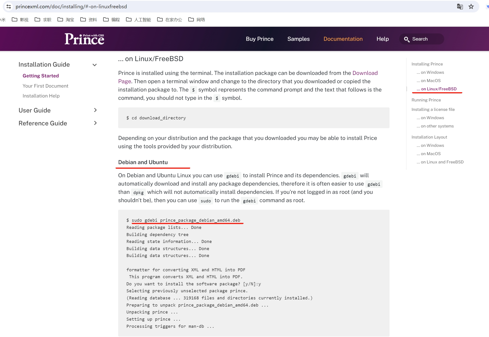
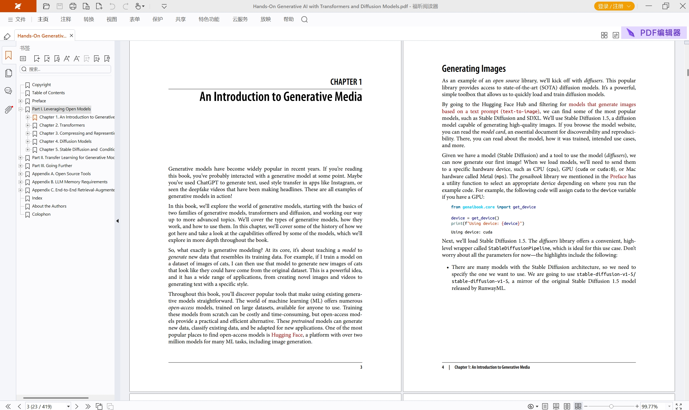
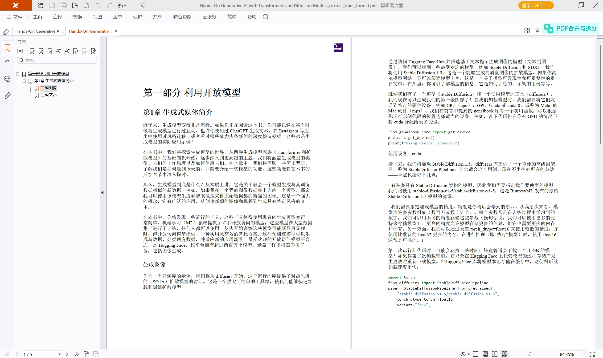
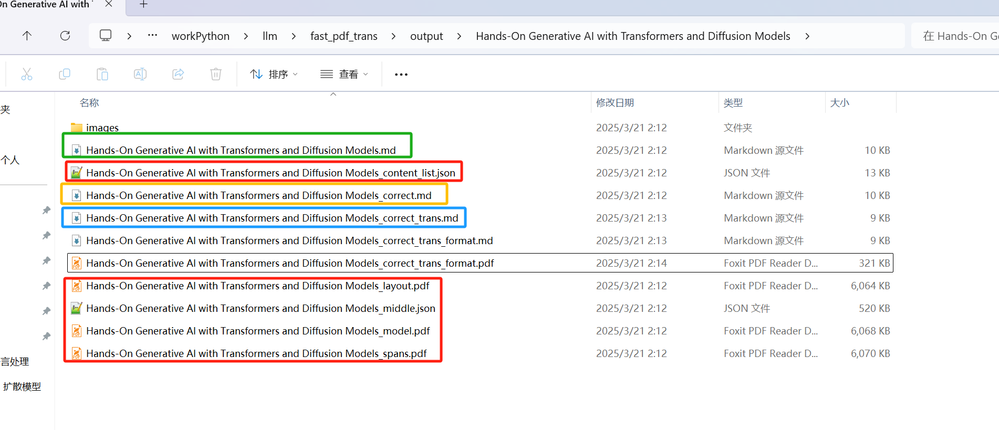
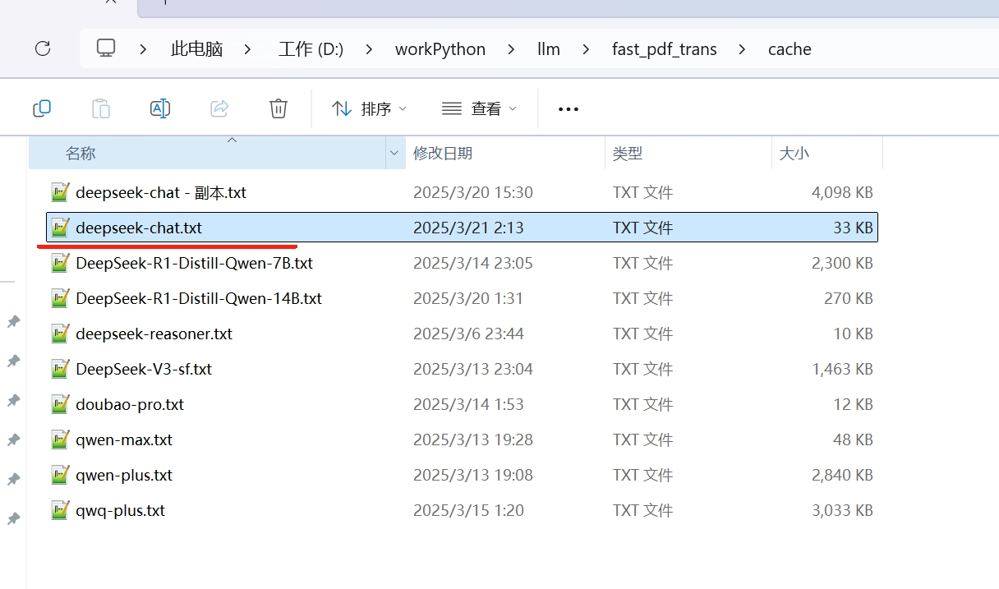

# Fast pdf translate  

## 项目简介  
Fast pdf translate是一款pdf翻译软件，基于[MinerU](https://github.com/opendatalab/MinerU)实现pdf转markdown的功能，接着对markdown进行分割，
送给大模型翻译，最后组装翻译结果并由pypandoc生成结果pdf。  

## 主要功能  
### pdf解析功能  
- 支持由pdf书签生成markdown标题（分级），魔改MinerU实现  
- 支持移除markdown代码块的非标题#号，魔改MinerU实现  
- 支持由大模型对MinerU生成的标题进行分级和过滤(无书签的场景)  
- 支持由大模型移除误识别的公式，魔改MinerU实现  
### 翻译功能  
- 支持所有兼容openai api的大模型  
- 支持流控限制、多线程、多个大模型同时翻译  
- 支持缓存，任务中断后再次执行时，问过的问题直接从缓存读取  
- 支持对大模型返回的代码块进行自动换行处理  
### 生成结果pdf  
- 基于pypandoc加[prince](https://www.princexml.com/)引擎实现  

## 系统要求  
主要就是MinerU的系统要求，故直接把它的抄过来了。  
注：内存不一定要那么大，如果pdf页数较多（400页以上），本软件支持逐页处理模式，整个过程内存增长在8G以内。  
<table>
    <tr>
        <td colspan="3" rowspan="2">操作系统</td>
    </tr>
    <tr>
        <td>Linux after 2019</td>
        <td>Windows 10 / 11</td>
        <td>macOS 11+</td>
    </tr>
    <tr>
        <td colspan="3">CPU</td>
        <td>x86_64 / arm64</td>
        <td>x86_64(暂不支持ARM Windows)</td>
        <td>x86_64 / arm64</td>
    </tr>
    <tr>
        <td colspan="3">内存</td>
        <td colspan="3">大于等于16GB，推荐32G以上</td>
    </tr>
    <tr>
        <td colspan="3">存储空间</td>
        <td colspan="3">大于等于20GB，推荐使用SSD以获得最佳性能</td>
    </tr>
    <tr>
        <td colspan="3">python版本</td>
        <td colspan="3">3.10 (请务必通过conda创建3.10虚拟环境)</td>
    </tr>
    <tr>
        <td colspan="3">Nvidia Driver 版本</td>
        <td>latest(专有驱动)</td>
        <td>latest</td>
        <td>None</td>
    </tr>
    <tr>
        <td colspan="3">CUDA环境</td>
        <td>自动安装[12.1(pytorch)+11.8(paddle)]</td>
        <td>11.8(手动安装)+cuDNN v8.7.0(手动安装)</td>
        <td>None</td>
    </tr>
    <tr>
        <td colspan="3">CANN环境(NPU支持)</td>
        <td>8.0+(Ascend 910b)</td>
        <td>None</td>
        <td>None</td>
    </tr>
    <tr>
        <td rowspan="2">GPU硬件支持列表</td>
        <td colspan="2">显存8G以上</td>
        <td colspan="2">
        2080~2080Ti / 3060Ti~3090Ti / 4060~4090<br>
        8G显存及以上可开启全部加速功能</td>
        <td rowspan="2">None</td>
    </tr>
</table>

## 安装  
建议使用conda安装，尤其是如果用gpu进行pdf解析的话。  

### 1.创建conda环境  
```commandline
conda create -n fast_pdf_trans python=3.10
conda activate fast_pdf_trans
```

### 2.安装MinerU  
```commandline
pip install "magic-pdf[full]==1.2.0" --extra-index-url https://wheels.myhloli.com
```
**如果要使用本软件魔改MinerU的相关功能（pdf书签等），就要严格使用上面指定的1.2.0版本，否则可以使用最新版本。**  
如果要使用英伟达gpu加速推理，请移步MinerU cuda环境安装文档（主要是重装cuda版的pytorch和paddlepaddle-gpu）:  
[Windows 10/11 + GPU](https://github.com/opendatalab/MinerU/blob/master/docs/README_Windows_CUDA_Acceleration_en_US.md)  
[Ubuntu 22.04 LTS + GPU](https://github.com/opendatalab/MinerU/blob/master/docs/README_Ubuntu_CUDA_Acceleration_en_US.md)  
**再次注意：**  
- **a.MinerU cuda环境的安装，仍然要注意1.2.0的问题哦！**  
- **b.不要忘了把C:\Users\你的用户名\magic-pdf.json中的如下配置** 
```json
    "device-mode": "cpu",
```
改为  
```json
    "device-mode": "cuda",
```
否则解析pdf时仍然不会用gpu的。
- c.安装cuda环境的详细过程也可以关注我的公众号，后续将放出详细安装过程，并且不限于MinerU的使用，只要是想用pytorch, paddle都可以参照。  
  


### 3.安装依赖  
cd到fast_pdf_trans项目目录下  
```commandline
pip install -r requirements.txt
```

### 4.下载模型  
**注意：如果你已经参照MinerU gpu环境文档安装过了，你可能已经把下载模型的步骤执行过了，
不用再重新下载模型了，可以对照下面的说明确认一下模型是否已经成功下载，以及magic-pdf.json中是否成功配置了模型目录。**  
**另外如果你又运行了一次下载脚本，magic-pdf.json中的"device-mode": "cuda",又会被覆盖成cpu。**  

可以使用本项目tools/download_models.py下载解析pdf所要用到的模型，该脚本通过modelscope下载模型（国内用户直接用它就行了）。
也可以使用tools/download_models_hf.py下载，该脚本通过huggingface下载。这两个脚本都是从
[MinerU scripts](https://github.com/opendatalab/MinerU/tree/master/scripts)复制过来的。
download_models_hf.py中我加上了代理的设置，请更新为你使用的代理（在国外的话则删除代理设置）。

以modelscope为例
```commandline
python tools\download_models.py
```
模型会下载到C:\Users\你的用户名\.cache\modelscope\hub\models目录下，并且脚本会自动当该目录保存到
C:\Users\你的用户名\magic-pdf.json文件中

**注意，在linux中就用你的当前用户来执行这个脚本，不要用root用户去执行，否则模型会下载到/root/.cache/modelscope中，
而你普通用户是访问不了/root这个目录的。**  

### 5.安装Prince  
如果你只需要将pdf解析为markdown并翻译成中文markdown，那就不需要安装Prince了。但是如果你还需要将它转换成中文pdf，则需要Prince。
请移步[Prince官网](https://www.princexml.com/download/16/)下载对应系统的版本。下面分别以windows和ubuntu为例：  
下面以windows为例，下载prince-16-win64.zip，解压到任意目录，比如D:\program，然后把"D:\program\prince-16-win64\bin"添加到系统环境变量PATH中。
- 以windows11为例(win10应该也差不多，顶多是找环境变量的过程可能稍有区别)，在文件浏览器中右击"此电脑"--"属性"--"高级系统设置"--"环境变量"--下面的"系统变量"，在里面找到Path，双击它打开，
在里面新建一项填"D:\program\prince-16-win64\bin"即可(填的时候并不需要双引号)。
修改完环境变量后，需要重新打开cmd命令行才有效(如果你用的是pycharm也是同理，需要重新打开pycharm)，执行where prince，看到如下结果表示Path加成功了
```json
(fast_pdf_trans) D:\workPython\llm\fast_pdf_trans>where prince
D:\program\prince-16-win64\bin\prince.exe

```
- 以ubuntu20.04为例，下载prince_16-1_ubuntu20.04_amd64.deb，参考[Prince Installation Guide](https://www.princexml.com/doc/installing/)  
  
点到ubuntu的安装部分，其实就一条命令，如果是root用户，直接执行：
```commandline
gdebi prince_16-1_ubuntu20.04_amd64.deb
```
否则执行：
```commandline
sudo gdebi prince_16-1_ubuntu20.04_amd64.deb
```
如果你没有安装gdebi，那就用apt安装一下就好啦
```commandline
apt update
apt install gdebi
```
非root用户还是注意加上sudo
```commandline
sudo apt update
sudo apt install gdebi
```
安装完prince之后执行which prince，看到如下结果表示成功安装了：
```commandline
(fast_pdf_trans) root@DESKTOP-U5878VE:/home/kv183# which prince
/usr/bin/prince
```

### 6.配置大模型  
本项目自身要用的配置都在conf.yaml中，里面各项都做了详细说明，**不要被它们吓到！**，接下来演示的功能，唯一要配置的就是一个大模型的api-key。
即如下这段，搜索ds_llm_agent即可找到，把里面的api_key的值sk-xxxxxxxxxx换成你自己的api_key：
```yaml
ds_llm_agent: # deepseek官方api，这里的'ds_llm_agent'是在别的配置中引用的名字，随便起什么都可以。更多的llm_agent示例见conf_llm_example.yaml
  base_url: https://api.deepseek.com/
  model_name: deepseek-chat
  api_key: sk-xxxxxxxxxx # api_key需要到对应平台创建
  timeout: 120
  max_retries: 2 # 开启流控的话则把这一项置0，否则会影响流控的计算
  use_cache: true # 开启缓存，会把大模型的响应缓存在文件中，下次同样的问题直接从缓存文件中读取，不会重复调用大模型
  cache_file_name: deepseek-chat # 缓存文件名。缓存目录就是项目目录的cache文件夹
  rate_control: # 没有明确说明流控的，可以不配置。也可以通过相关任务的线程数来控制访问频繁。
  streaming: false # 流式输出，没有强制要求流式输出的，可以指定为false
```
你如果没有api_key，请移步[deepseek官网](https://platform.deepseek.com/usage)注册并充值~~
你如果不想用deepseek，只要是兼容openai-api的大模型，都可以配置在这里。你可以看到下面还有qwq_llm_agent、
free_llm_agent，在conf_llm_example.yaml中还有更多的示例。  
其实这里配置的ds_llm_agent是在如下配置中使用的：
```yaml
llm_translator: # markdown翻译配置
  need_format_code: true # 大模型翻译提示词中会让大模型把代码段加上```的代码段标记，此处的配置为true，则会在代码段中将超长的代码行自动换行，否则在pdf中可能显示不全。
  need_correct_imagepath: true # markdown段落中会有图片链接，部分模型（比如qwen的qwq）翻译后有可能把图片链接改错了。此配置为true会匹配原文的图片链接进行修正。
  timeout: 120 # 每一段翻译的超时时间
  max_workers: 4 # 调大模型的线程数，部分模型可能没有说明流控，但调频繁了还是会超时，则可以降低线程数，或者尝试设置流控。
  llm_agent_name: # 对应的大模型配置项的键，比如下面的ds_llm_agent，qwq_llm_agent等，模型越强大，翻译效果越好。
    - ds_llm_agent # 可以配置多个大模型（比如不同帐号的deepseek），但不建议配置多个不同类型、来源的大模型，除非你不需要cache
  title_add_size: 20 # 尝试在分段时将标题和下面的内容合在一起，此处即为标题预设的token数。
  chunk_size: 200 # 分段调大模型翻译，此处即为每段的token数，不要超过对应大模型的输入或输出长度。
```
这就是markdown翻译的配置，里面的llm_agent_name其实是一个list，只不过现在是只有一项的list，这一项的值就是"ds_llm_agent"。
这个值对应的就是上面那段配置的键名。所以如果你想使用别的大模型配置，假设就使用conf.yaml中已经有的qwq_llm_agent，那修改翻译配置如下（只展示修改的部分）：
```yaml
llm_translator: # markdown翻译配置
  llm_agent_name: # 对应的大模型配置项的键，比如下面的ds_llm_agent，qwq_llm_agent等，模型越强大，翻译效果越好。
    - qwq_llm_agent # 可以配置多个大模型（比如不同帐号的deepseek），但不建议配置多个不同类型、来源的大模型，除非你不需要cache
```
所以说你也完全可以自己新建一段大模型的配置，自己起个名字，比如叫qwenmax_llm_agent，然后在翻译配置中指定用它。  
**但是要注意：大模型配置里面的每一项配置的用法都是统一的，具体看注释。**  
如果你有多个deepseek帐号，每个分别有一个api-key，那你就可以新建一个deepseek的配置，比如叫ds_llm_agent1，然后把它加到翻译配置中，如下（仅展示修改部分）
```yaml
llm_translator: # markdown翻译配置
  llm_agent_name: # 对应的大模型配置项的键，比如下面的ds_llm_agent，qwq_llm_agent等，模型越强大，翻译效果越好。
    - ds_llm_agent # 可以配置多个大模型（比如不同帐号的deepseek），但不建议配置多个不同类型、来源的大模型，除非你不需要cache
    - ds_llm_agent1
```
- 这样有可能会调的更快（翻译时会轮换调用各模型），并且此时你可以尝试把max_workers调的更大。但是如果你是一个帐号下的多个api-key，那多半就没有必要这样做了。  
- 我只是自己用一个帐号的多个api-key模拟了一下，测试翻译功能是否正常(deepseek要实名认证，所以我只有一个号啦)。
- 另外解释一下上面的注释里面为什么说不建议用多个不同的大模型，比如你用了多个不同的大模型，并且想使用缓存文件，缓存文件名不一样。
有可能这一次翻译时，问题1由模型1回答，问题2由模型2回答，分别存在两个缓存文件中。但是你又想再执行一次翻译任务，由于是多线程执行，
指不定先跑问题1还是先跑问题2，所以问题1未必还是由模型1来回答，如果不是的话，缓存就没法命中了。
- 如果你说，你多个不同的模型使用相同的缓存文件，从运行逻辑上说是ok的，也不会存在多线程写冲突的问题，因为我用的是缓存文件名为key从字典中取的线程锁。
但是不同的模型用相同的缓存文件，有点乱，如果翻译质量有问题，你都不知道是哪个模型的问题啦。
- **但是，如果你同时执行了多次本软件，或者在多个进程中调用本软件，然后还使用了相同的缓存文件，那就有可能会有写冲突！**

**至此，所有准备工作就都完成了！**

## 运行  
现在我有一本"Hands-On Generative AI with Transformers and Diffusion Models.pdf"，现在测试一下，让它翻译21页到27页，cd到fast_pdf_trans项目目录下，执行：
```commandline
python translate.py "D:\学习\机器学习\GAN、扩散模型\Hands-On Generative AI with Transformers and Diffusion Models.pdf"  --start-page 21 --end-page 27
```
注意这里的--start-page，--end-page的值都是从1开始计数的。如果这两个参数都不传，则会翻译整个pdf。各命令行参数的含义可以执行python translate.py -h进行查看。  

本次运行的条件是这是一个文字版pdf（非扫描版），有书签，无公式，其它场景后面会再详细例举。  
  

最后看到
```commandline
2025-03-21 02:14:01,684 llm_translate.translator translate 30 INFO     finish all step, result_pdf_path: D:\workPython\llm\fast_pdf_trans\output\Hands-On Generative AI with Transformers and Diffusion Models\Hands-On Generative AI with Transformers and Diffusion Models_correct_trans_format.pdf
```
表示结果pdf路径就是：D:\workPython\llm\fast_pdf_trans\output\Hands-On Generative AI with Transformers and Diffusion Models\Hands-On Generative AI with Transformers and Diffusion Models_correct_trans_format.pdf
  

本次没有指定输出文件的目录，所以默认是在项目目录的output文件夹下。
  
如上图：
- 绿框是通过MinerU解析pdf后生成的markdown文件，但是本次使用了pdf书签生成markdown标题（在conf.yaml中有默认配置，后面详述），
所以这个markdown文件里的标题看起来会有点奇怪，是我做了特殊记号的（用于标记标题级别）。
- 黄框是在MinerU生成的markdown的基础上，进行一些修改操作，比如把上面的标题级别的标记还原成实际的markdown标题级别。
或者在没有使用pdf书签的情况下，通过大模型修正markdown标题级别，也会在本文件中完成。
- 蓝框就是翻译后的中文markdown了。
- 红框是MinerU解析pdf后我保存的一些调试数据，比如layout.pdf, spans.pdf可以直接去看看。
- 没有框起来的那两个文件，_correct_trans_format.md是在翻译完的markdown的基础上又进行了一些修正操作，比如将代码段中超长的代码行自动换行。_correct_trans_format.pdf就是最终的翻译结果啦。

所以如果已经完成了pdf到markdown的解析步骤，在翻译的过程中，手动中断了翻译任务（或者产生未知的异常中断了翻译任务），
可以再次运行相同的命令，pdf解析这一步是不会再重复执行的，因为相关的markdown已经存在了。  
而已经翻译过的段落，实际上已经保存在缓存文件中了，所以会直接从缓存文件读取，不会再去调api。

是否开启缓存也是配置在conf.yaml的大模型配置中的，如下只展示缓存配置
```yaml
ds_llm_agent: # deepseek官方api，这里的'ds_llm_agent'是在别的配置中引用的名字，随便起什么都可以。更多的llm_agent示例见conf_llm_example.yaml
  use_cache: true # 开启缓存，会把大模型的响应缓存在文件中，下次同样的问题直接从缓存文件中读取，不会重复调用大模型
  cache_file_name: deepseek-chat # 缓存文件名。缓存目录就是项目目录的cache文件夹
```
所以缓存文件名就是deepseek-chat.txt，它就在本项目的cache文件夹下：  
  
其实通过这个文件来检查大模型的回答还挺方便。如果不想再用过去的缓存，可以自行删除这些文件。

## 更多翻译场景  
见[how_to_translate_different_pdfs_zh-CN.md](docs/how_to_translate_different_pdfs_zh-CN.md)  

## License Information  
[LICENSE.md](LICENSE)  
本项目目前采用PyMuPDF以实现高级功能，其遵循AGPL协议，

## Acknowledgments  
- [MinerU](https://github.com/opendatalab/MinerU)  
- [PDF-Extract-Kit](https://github.com/opendatalab/PDF-Extract-Kit)  
- [DocLayout-YOLO](https://github.com/opendatalab/DocLayout-YOLO)  
- [StructEqTable](https://github.com/UniModal4Reasoning/StructEqTable-Deploy)  
- [RapidTable](https://github.com/RapidAI/RapidTable)  
- [PaddleOCR](https://github.com/PaddlePaddle/PaddleOCR)  
- [PyMuPDF](https://github.com/pymupdf/PyMuPDF)  
- [layoutreader](https://github.com/ppaanngggg/layoutreader)  
- [fast-langdetect](https://github.com/LlmKira/fast-langdetect)  
- [pdfminer.six](https://github.com/pdfminer/pdfminer.six)  
- [langchain](https://github.com/langchain-ai/langchain)  
- [pandoc](https://github.com/jgm/pandoc)  
- [pypandoc](https://github.com/JessicaTegner/pypandoc)  