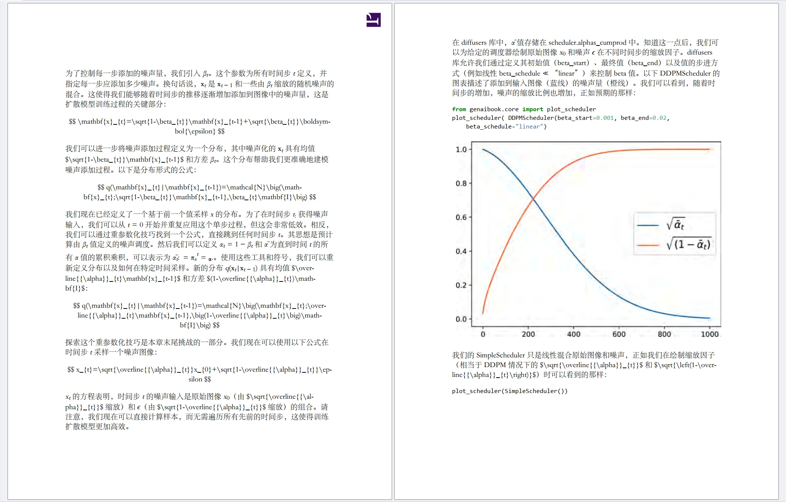
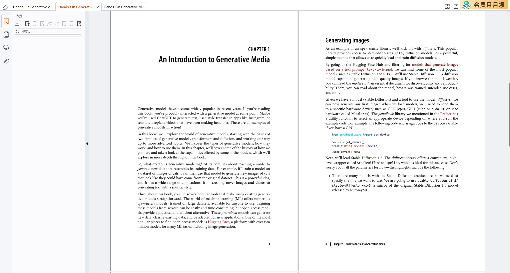

# 常见翻译场景及配置说明

## pdf包含公式（顺便说一下流控）
  
如上图，即有行间公式，也有行内公式，此时我们就需要启用公式识别的开关。修改本项目目录下的conf.yaml里如下配置(仅展示相关配置)
```yaml
doc_convertor: # 文档转换器配置，主要是pdf转成markdown的相关配置
  table_enable: false # 透传MinerU的参数，false则直接将表格截图，否则会解析表格中的内容。开启会降低转换速度，并且有可能导致结果pdf渲染失败。如非必要，不建议开启。
  formula_enable: true # 透传MinerU的参数，true则进行公式识别并转换成Latex格式。开启会降低转换速度，并且有可能把非公式字符解析成特殊格式。除非确定pdf中有公式，否则不要开启。
  remove_error_formula: true # 魔改MinerU的功能，暂时只排除代码块中的公式。因为代码中不可能有Latex公式，并且代码段中的字符经常被公式格式。只有在formula_enable开启时才有效。
  override_history: true # 解析pdf的流程为pdf->markdown->修正标题的markdown，后面为翻译流程。如果上次任务执行失败，可以再次执行。已经完成的解析pdf步骤不会再重新执行。开启此项之后会删除输出目录下的所有文件，重新执行整个任务。
```
- 将这里的formula_enable改为true，原来默认是false的。但是要注意，开启公式识别，不建议用cpu环境，请配置cuda环境，
具体见[README_zh-CN 2安装mineru](../README_zh-CN.md#2安装mineru-)，因为公式识别所用的模型计算量比较大，用cpu环境会非常慢。
- 如上配置中我还放了两个跟公式其实没啥关系的配置进来，一个是table_enable，开启它就会进行表格识别，会把表格转换成
html的table格式，否则直接对表格进行截图。如果想开启表格识别也是建议安装cuda环境，否则也会很慢。并且表格列数如果较多有可能导致生成的pdf中表格超出页面范围，
所以如非必须翻译表格，不建议开启表格识别。
- 另一个配置就是override_history，由于下面我要多次测试同一个pdf文件，所以我开启了这个配置后，每次执行任务时，都会把对应的输出目录清空，这样所有步骤（pdf解析、翻译）都是重新执行的。
- 上面还有一个remove_error_formula，该配置项默认就是开启的，它的作用就是在开启了公式识别后，把误识别的公式还原成原来的文本。目前只实现了代码块的还原。需要用到大模型。

不过这里用的大模型跟翻译用的大模型是分开的，所以你还得再配置一下：
```yaml
batch_analyze: # remove_formula_from_code的具体配置
  llm_agent_name: free_llm_agent # 判断文本块是否包含代码，通过问大模型实现，此处不需要特别强的大模型，故可以用14b的R1模型。
  max_workers: 8 # 调大模型的线程数
  timeout_per_job: 60 # 每一次调用的超时时间
```
这里用的大模型的配置项名称为free_llm_agent（当然喽，还是一样，你可以改为任何支持openai api的大模型）
```yaml
free_llm_agent: # 硅基流动平台，支持多种模型，这里的14B其实不免费，7B及以下是免费的
  base_url: https://api.siliconflow.cn/
  model_name: deepseek-ai/DeepSeek-R1-Distill-Qwen-14B
  api_key: sk-xxxxxxxxxxxxxxxx
  timeout: 60
  max_retries: 0 # 开启流控的话则把这一项置0，否则会影响流控的计算
  use_cache: true
  cache_file_name: DeepSeek-R1-Distill-Qwen-14B
  rate_control: free_rate_control # 在硅基流动平台模型详情中能看到明确的流控限制，所以要配置。
  streaming: false
```
- 这里用的是[硅基流动平台](https://siliconflow.cn/)的DeepSeek-R1-Distill-Qwen-14B模型，原因是判断一段文本是不是代码，这并不是一个很难的问题，14B的R1模型足够了，又便宜又快。
注意，14B并不完全免费，deepseek-ai/DeepSeek-R1-Distill-Qwen-7B才是完全免费的，实际上7B应该也行，可能准确度稍微低一点。**你唯一要做的仍然只是把对应的api_key填上**  
- 另外注意，硅基流动平台是有明确的流控限制说明的，如下图，只要你没买特级包，基本就是L0啦，你就把对应的RPM和TPM配置到流控配置中就行了。注意上面的rate_control这一项，对应的流控配置项名称是free_rate_control  
  
对应流控配置如下，你如果用的就是硅基流动的14B模型，那就不用改了，我已经帮你配置好了：  
```yaml
free_rate_control: # 流控配置，采用滑动窗口进行统计
  rpm: 1000 # 每分钟访问次数上限，其实不一定是每分钟，具体看window_gap的配置
  tpm: 40000 # 每分钟发送token数上限
  wait_seconds: 20 # 超流控之后等待20秒后再试
  max_retry: 20 # 重试20次如果还超流控，则该条消息失败
  window_gap: 60 # 流控滑动窗口的长度，单位秒。配置为60，就是每分钟的流控。
  token_encoding: cl100k_base # token编码方式，openai gpt系列用的就是这个
```

一切准备完毕，还是翻译扩散模型那本书，在151页到153页，既有公式又有代码，执行如下命令：
```commandline
python translate.py "D:\学习\机器学习\GAN、扩散模型\Hands-On Generative AI with Transformers and Diffusion Models.pdf"  --start-page 151 --end-page 153  
```


- 翻译结果如上图，代码块基本都不存在误识别的公式，**但是这里有一个严重的问题。。。，复杂的行间公式并没有成功显示出来**，其实pdf解析出来的markdown文件是没有问题的，
翻译完了的markdown也没有问题，只是我暂时不知道怎么用pandoc生成这种复杂Latex格式的pdf，暂时只能上替代方案了！见下一节[借助vscode插件生成pdf](#借助vscode插件生成pdf-)  
- 另外你也会发现，开启了公式识别并且开启移除错误公式，解析pdf的速度明显慢了很多，所以**如果你确定pdf中没有公式的话，就不要开启公式识别。**


## 借助vscode插件生成pdf  
**注意，只有在本软件生成结果pdf有问题时，才需要用到此替代方案。**  
在[vscode](https://code.visualstudio.com/)上安装一个插件"Markdown Preview Enhanced"。  
  

安装好了就可以用它打开翻译任务的结果目录，然后选中中文markdown，并且点击右边的预览按钮。  
  

然后点击右下角的菜单按钮  
  

依次点击"Export"--"PDF(Prince)"
  

这下公式显示正常了！  
  
注意，这里的Prince其实就是我们之前安装的Prince，参见[README_zh-CN 5安装prince](../README_zh-CN.md#5安装prince-)  

## 使用命令行参数  
有一些可能常用并且频繁修改的配置，也可以在命令行中指定，可以执行如下命令查看命令行所有参数解释。
```commandline
python translate.py -h
```
  
上图红框之上的参数是与conf.yaml无关的，红框之下的参数是包含在conf.yaml中的，如果要以命令行参数为准，就必须指定--override-conf，比如还是之前开启公式识别的例子。
但是在命令行中开启，则执行如下命令：  
```commandline
python translate.py "D:\学习\机器学习\GAN、扩散模型\Hands-On Generative AI with Transformers and Diffusion Models.pdf"  --start-page 151 --end-page 153  --override-conf  --formula-enable  --remove-error-formula --replace-anno-in-texts --override-history 
```
我们一下加了好几个可选项进来，那是因为如果用命令行参数覆盖conf.yaml，所有要开启的参数你都得加到命令行中（即action="store_true"的那些参数），我觉得还是直接改conf.yaml更方便。。  

## 无书签  
一般情况下，pdf都是有书签的，尤其是很多英文资料。但是对于无书签的pdf，MinerU本身会检测出pdf的标题，全作为markdown的一级标题。
本项目会抽出markdown中的所有标题，然后让大模型帮忙分一下标题层级，并且把多余的标题去掉。
  
以上图文档为例（其实tensorrt文档是有书签的，但是我把它们都删了）

先修改一下conf.yaml，把correct_header_type修改为by_llm_easy，如下（仅展示相关配置）  
```yaml
doc_convertor: # 文档转换器配置，主要是pdf转成markdown的相关配置
  # MinerU将pdf转成markdown时，都是一级标题，并且可能有多余的标题，所以需要进行修正
  correct_header_type: by_llm_easy # no/bookmark/by_llm/by_llm_easy no:不修正，bookmark:通过pdf书签修正，by_llm:通过大模型修正，by_llm_easy:通过大模型修正，但只保留1、2级标题，有书签则选bookmark，否则建议选by_llm_easy
```
correct_header_type默认设置为bookmark，即根据pdf书签来决定markdown的标题和层级，如果发现pdf没有书签，则会回退到原本的MinerU检测标题的功能，
即全是一级标题。所以得做如上配置修改，才会由大模型修正标题。  

在conf.yaml中还有一段配置如下（仅展示by_llm_easy模型的相关配置）， 
```yaml
header_corrector: # 利用大模型对MinerU返回的所有标题进行修正，删除多余标题，修正标题层级，仅在correct_header_type为by_llm/by_llm_easy时启用
  allow_distance: 3 # 大模型返回的修正层级的标题，与原标题进行匹配时的最大编辑距离
  allow_diff_chars: ['$', ' ', ' '] # 这里面的字符不计入编辑距离
  llm_agent_name: ds_llm_agent # 对应的大模型配置项的key，比如下面的ds_llm_agent，qwq_llm_agent等，自己建一段配置也可以，此功能需要强力的大模型，比如deepseek R1/V3，qwen-max
```
- **你主要要关注的就是llm_agent_name，这就是修正标题用的大模型，** 默认用的是跟翻译任务相同的deepseek模型，如果你也是这样，那就不用改了。
- 编辑距离的两个配置，是要将大模型修正后的标题跟原标题进行匹配，用的就是字符串最小编辑距离算法。
- 这里用的大模型请不要节省！能用多强的大模型，就用多强的，不然可能起到反面效果。其实token消耗是很少的。

执行如下命令：  
```commandline
python translate.py "D:\学习\机器学习\nvidia\tensorrt\TensorRT-Developer-Guide-no-bookmark.pdf"  --only-pdf2md 
```
这里在命令行参数中加了个--only-pdf2md，表示只执行pdf解析为markdown的步骤，不进行翻译，整个200页的文档的翻译就比较耗时了，这里只是展示无书签情况下markdown标题的分级效果。  

看到如下结果表示markdown生成完毕，并且已经修正标题层级了。
```commandline
2025-03-22 15:06:25,694 llm_translate.corrector.easy_header do_correct 162 INFO     correct header finish: D:\workPython\llm\fast_pdf_trans\output\TensorRT-Developer-Guide-no-bookmark\TensorRT-Developer-Guide-no-bookmark_correct.md
2025-03-22 15:06:25,694 llm_translate.translator translate 20 INFO     only_pdf2md is True, only do pdf2md, md_path: D:\workPython\llm\fast_pdf_trans\output\TensorRT-Developer-Guide-no-bookmark\TensorRT-Developer-Guide-no-bookmark_correct.md
```
  
- 在vscode中预览一下markdown，如果你预览不了，请安装相关插件，请参照[借助vscode插件生成pdf](#借助vscode插件生成pdf-)。如上图，红框文件就是MinerU生成的，绿框是修正层级之后的
markdown文件，可以看到右边的标题层级已经修正了。  
- 为什么只有1、2级标题？因为by_llm_easy模型下，我只让大模型生成1、2级标题，经常多次尝试，这种情况下的结果普遍比较稳定。  
- 任何pdf都能稳定生成1、2级标题吗？肯定不是，如果标题中没有明显的级别特征（比如字母数字、章节字样），那大模型也无法判断出准确的层级关系了。所以有书签还是最稳的。  
- 如果把correct_header_type设置为by_llm就不再限制标题层级，并且由于总标题可能过长，会分段送给大模型修正，但是不太稳定，经常会有层级判断错误的情况，故建议就用简单的模式吧。  


## ocr  
如果pdf是扫描版的，MinerU会通过pdf的元数据进行自动判断，以决定是否需要进行ocr。我把扩散模型那本书的第21-27页虚拟打印到另一个pdf中，
它就变成了扫描版（不过很清晰~~），书签也没了（当然喽，扫描版pdf如果有书签，仍然是可以利用书签得到markdown标题的）。如下：  
  
执行如下命令：  
```commandline
python translate.py "D:\学习\机器学习\GAN、扩散模型\Hands-On Generative AI with Transformers and Diffusion Models-21-27-print.pdf" 
```
注：doc_convertor.correct_header_type用的是上一节的by_llm_easy，因为没有书签。  
翻译结果如下：  
  
- 效果还不错，不过其实这个pdf（指完整的全书，不管是否扫描版）如果没有书签的话，他最终生成的标题是会丢失很多的，因为每一章的标题的CHAPTER X跟标题内容中间有一个水平分隔线，
doclayout模型会把它们分开，下面的识别为标题，上面的识别成丢弃框（可能是误判成页眉了）。最终的标题里就没有章节特征，大模型也无法正确判断。
- 如果由于某些原因，MinerU没判断你的pdf要ocr，但实际上你需要ocr，则可以修改conf.yaml中的如下配置（仅展示相关配置），把force_ocr改成true就行了    
```yaml
doc_convertor: # 文档转换器配置，主要是pdf转成markdown的相关配置
  # MinerU将pdf转成markdown时，都是一级标题，并且可能有多余的标题，所以需要进行修正
  force_ocr: true # true则解析pdf中的文档内容时强制使用ocr进行文字识别，文字版的pdf多数不需要开启（除非格式特殊，解析不出文字，则可以开启）。
```

## 内存不够  
如果pdf页数很多的话，解析pdf时会占用较多的内存，如果内存不够，可以修改conf.yaml中的如下配置（仅展示相关配置），把single_mode改为true即可。  
```yaml
doc_convertor: # 文档转换器配置，主要是pdf转成markdown的相关配置
  single_mode: true # MinerU解析pdf时，显存大于8G默认走batch-mode，但是页数多的时候有可能会占用更多内存，开启此项后强制不走batch-mode，
```
这只会影响解析pdf的速度，跟后面的翻译无关。如果开了公式识别并且开了移除错误公式（remove_error_formula）则会更慢一点，因为single-mode就是逐页处理，
而remove_error_formula会多线程调用大模型，逐页的时候效率会低一点。